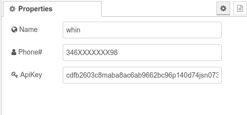
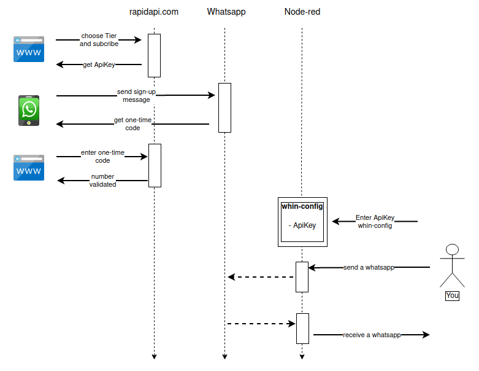
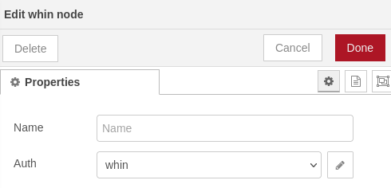
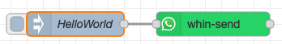
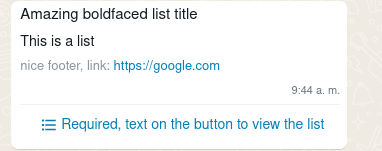
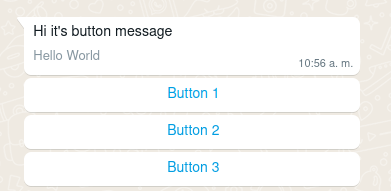
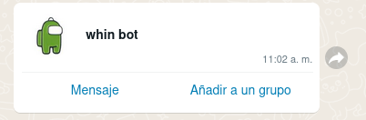
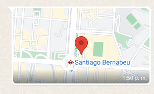

# Summary
Whin is a whatsapp gateway designed to support home-lab most frequent use cases for free; the back-end acts as a whatsapp shared gateway, the client side is a set of node-red nodes available at the editor Palette.


## Install: 

To install whin, your first choice should be using node-red editor Palette. Find the repo: @inutil-labs/node-red-whin-whatsapp and install.

As an alt method: open a terminal, cd to the user modules directory (tipically ~/data/node_modules/), git clone this repository inside, cd into the folder created, and run this command:

    npm install @inutil-labs/node-red-whin-whatsapp


## Set-up whin:

You need to become a whin user to get your user credentials. There's a free Tier for home-Lab owners which will cover (hopefully) all your needs, so there's no intrinsic cost associated to use whin. If you click on this [link](https://www.youtube.com/watch?v=uOZ-oH4kP58) you can watch a step-by-step video showing how to get subscribed to whin **free Tier**.

After you are subscribed, you can follow this [video](https://youtu.be/qC_U80JGyUw) to install and set up the nodes included on whin package.

If you don't like following videos, the back-end API documentation and how-to tutorials can be found [here](https://rapidapi.com/inutil-inutil-default/api/whin2/).

All whin nodes installed share a configuration node that stores your user credentials. Once you get subscribed an ApiKey will show up: copy it; then open the configuration node and paste it on the field named: *ApiKey*. That's all you need to do to start using whin.

A whin-config node looks like this when properly configured:



### About the ApiKey:
The *ApiKey* field is expecting a string, numbers and letters with no spaces. If you get stucked, check this [video](https://www.youtube.com/watch?v=uOZ-oH4kP58) and see from where can you copy the key that you have to paste on the config node.
Note that the ApiKey value is linked with the phone number you used to sign-up. Consequently the messages sent from node-red will always be delivered by whin to the phone number linked with the ApiKey used. This is to prevent spam.

Each ApiKey is valid forever as long as you keep subscribed to whin; this remains true even if you are subscribed to the free plan.

### Infographic of the set-up:
This picture shows the overall process:
1. subscribe to the free tier and get an apikey.
2. send a sign-up message to link your phone number with the apikey.
3. config whin on node-red.




## Whin Nodes:
When you install @inutil-labs/node-red-whin-whatsapp package, you will get two nodes available on node-red Palette under the Network category: 
- whin-receive, 
- whin-send.

These Nodes rely on a configuration Node called whin-config (not visible on the editor Palette).

### The Configuration Node (whin-config):
This node will be used to enter your credentials; the credentials will be available and shared among all whin nodes.
If you happen to have several phone numbers at home, you will need an ApiKey for each number and create a profile for each on the whin-config node.
This is the field that you need to complete to set up the whin-config node:


### Sender (whin-send):
This is the node we recomend you start using, right after you complete the config-node set-up. Just select the configuration you saved:


Wire an inject node to whin-send, choose the type of message you want to send (see all types and its schemas below), and you should receive the whatsapp on your client (web or app). 
Anything that comes in whin-send as data payload will be sent, and bear in mind the payload MUST be a JSON object with any of the valid schemas described below:



### Listener (whin-receive):
Whin allows you to send whatsapps to your node-red environment; any message you send to whin from the whatsapp number linked to the ApiKey, will be received on node-red.
You might create your own syntax to trigger stuff in node-red from whatsapp. Switching on lights or music, disconnect the alarm, run a sales report, send a document and process it on node-red somehow... Sky is the limit.

The Listener can operate on two different modes: webhook mode and always-on mode. Depending on the mode, you need to use whin-receive node or not.

#### Running on webhook mode:
This option is available for all whin users on all Tiers. 
You need to expose a webhook route (using a standard http-in node) for this mode to work; the route will receive all whatsapps as http POSTs. All you need to do is set the route configuration to tell whin back-end where you wish the messages to be delivered.
You can follow this [video](https://www.youtube.com) showing how to set a webhook route, how to change to a new route, delete it...
Any tool that allows exposing an end-point is valid (ngrok, cloudflare tunnel, expose a proxy, opening a port,...), click on the links to watch videos showing how-to.

#### Running on always-on mode:
This option is available for users on paid plans (any). 
After adding this node to a flow, when you hit deploy on the node-red editor, you will see that whin-receive shows a green message saying: "Connected to Whatsapp". No further configuration is needed, nor is needed exposing any route or opening ports.
The whin-receive node will stablish a persistent connection to whin back-end, it will receive any whatsapp as a raw stream at your end.


## Types of messages:
Whin will send / receive several types of messages, you can send:
- text messages.
- buttons.
- lists.
- vCards.
- locations.

You need to set the right payload schema so that the back-end understands the request you send, otherwise whin wont be able to route the message.

### Text message:
If you want to send a text, the msg.payload schema expected is a JSON object:

```json
{
  "text" : "this is a text sent from whin"
}
```
You will send a regular text message.

### List message:
If you want to send a list, the msg.payload schema expected is a JSON object:
```json
{
  "text": "This is a list",
  "footer": "nice footer, link: https://inutil.info",
  "title": "Amazing boldfaced list title",
  "buttonText": "Required, text on the button to view the list",
  "sections": 
  [
    {
	"title": "Section 1",
	"rows": [
	    	{"title": "Option 1", "rowId": "option1"},
	    	{"title": "Option 2", "rowId": "option2", "description": "This is a description"}
		]
    },
   {
	"title": "Section 2",
	"rows": [
	    	{"title": "Option 3", "rowId": "option3"},
	    	{"title": "Option 4", "rowId": "option4", "description": "This is a description V2"}
		]
    }
  ]
}
```
This is how it looks the message that you will send:



### Buttons message:
If you want to send a set of buttons, the msg.payload schema expected is a JSON object:
```json
{
    "text": "This is a button message",
    "footer": "Hello World",
    "buttons": [
  		{"buttonId": "id1", "buttonText": {"displayText": "Button 1"}, "type": 1},
  		{"buttonId": "id2", "buttonText": {"displayText": "Button 2"}, "type": 1},
  		{"buttonId": "id3", "buttonText": {"displayText": "Button 3"}, "type": 1}
		],
    "headerType": 1
}
```
This is how it looks the message that you will send:




If you want to send a set of buttons with an image header, the msg.payload schema expected is a JSON object:
```json
{
    "image": {"url": "https://inutil.info/img/portfolio/4.jpg"},
    "caption": "This is a button message with img",
    "footer": "Hello World",
    "buttons": [
  		{"buttonId": "id1", "buttonText": {"displayText": "Button 1"}, "type": 1},
  		{"buttonId": "id2", "buttonText": {"displayText": "Button 2"}, "type": 1},
  		{"buttonId": "id3", "buttonText": {"displayText": "Button 3"}, "type": 1}
		],
    "headerType": 4
}
```


### vCard message:
If you want to send a contact vCard, the msg.payload schema expected is a JSON object:

```json
{
    "contacts": {
        "displayName": "whin",
        "contacts": [
            {
                "vcard": "BEGIN:VCARD\nVERSION:3.0\nFN:whin bot\nORG:Inutil Labs;\nTEL;type=CELL;type=VOICE;waid=34605797764:+34 605 797 764\nEND:VCARD"
            }
        ]
    }
}
```

This is how it looks the message that you will send:



### Location message:
If you want to send a Location, the msg.payload schema expected is a JSON object:

```json
{
    "location": {
        "degreesLatitude": 40.4526941,
        "degreesLongitude": -3.6897589
    }
}
```
This is how it looks the message that you will send:



## Sample Flows:

We are including a very simple set of flows under the examples folder on this repo. Use the examples to understand how the different messages formats are. We strongly recommend you use them to bootstrap your own use cases so that you get familiar with them.

Or you can also import this flow and test them all at once.

```
[{"id":"b3f12d9fe67d298a","type":"inject","z":"a2b5a95f0173aba2","name":"list","props":[{"p":"payload"}],"repeat":"","crontab":"","once":false,"onceDelay":0.1,"topic":"","payload":"{\"text\":\"This is a list from whin\",\"footer\":\"nice footer, link: https://inutil.info\",\"title\":\"Amazing boldfaced list title\",\"buttonText\":\"Required, text on the button to view the list\",\"sections\":[{\"title\":\"Section 1\",\"rows\":[{\"title\":\"Option 1\",\"rowId\":\"option1\"},{\"title\":\"Option 2\",\"rowId\":\"option2\",\"description\":\"This is a description\"}]},{\"title\":\"Section 2\",\"rows\":[{\"title\":\"Option 3\",\"rowId\":\"option3\"},{\"title\":\"Option 4\",\"rowId\":\"option4\",\"description\":\"This is a description V2\"}]}]}","payloadType":"json","x":290,"y":100,"wires":[["87c043c001c38b5f"]]},{"id":"87c043c001c38b5f","type":"whin-send","z":"a2b5a95f0173aba2","name":"","auth":"b1f46bed1b0c6327","x":630,"y":200,"wires":[[]]},{"id":"f5e0f4ecdd624eb1","type":"inject","z":"a2b5a95f0173aba2","name":"buttons","props":[{"p":"payload"}],"repeat":"","crontab":"","once":false,"onceDelay":0.1,"topic":"","payload":"{\"text\":\"This is a button message\",\"footer\":\"Hello World\",\"buttons\":[{\"buttonId\":\"id1\",\"buttonText\":{\"displayText\":\"Button 1\"},\"type\":1},{\"buttonId\":\"id2\",\"buttonText\":{\"displayText\":\"Button 2\"},\"type\":1},{\"buttonId\":\"id3\",\"buttonText\":{\"displayText\":\"Button 3\"},\"type\":1}],\"headerType\":1}","payloadType":"json","x":290,"y":160,"wires":[["87c043c001c38b5f"]]},{"id":"3f8228e7c05e7102","type":"inject","z":"a2b5a95f0173aba2","name":"buttons and image","props":[{"p":"payload"}],"repeat":"","crontab":"","once":false,"onceDelay":0.1,"topic":"","payload":"{\"image\":{\"url\":\"https://inutil.info/img/portfolio/4.jpg\"},\"caption\":\"This is a button message with img\",\"footer\":\"Hello World\",\"buttons\":[{\"buttonId\":\"id1\",\"buttonText\":{\"displayText\":\"Button 1\"},\"type\":1},{\"buttonId\":\"id2\",\"buttonText\":{\"displayText\":\"Button 2\"},\"type\":1},{\"buttonId\":\"id3\",\"buttonText\":{\"displayText\":\"Button 3\"},\"type\":1}],\"headerType\":4}","payloadType":"json","x":330,"y":220,"wires":[["87c043c001c38b5f"]]},{"id":"087c3e77df8d470e","type":"inject","z":"a2b5a95f0173aba2","name":"text","props":[{"p":"payload"}],"repeat":"","crontab":"","once":false,"onceDelay":0.1,"topic":"","payload":"{\"text\":\"this is a text sent from whin\"}","payloadType":"json","x":290,"y":40,"wires":[["87c043c001c38b5f"]]},{"id":"8d22d09848a51ae7","type":"inject","z":"a2b5a95f0173aba2","name":"vCard","props":[{"p":"payload"}],"repeat":"","crontab":"","once":false,"onceDelay":0.1,"topic":"","payload":"{\"contacts\":{\"displayName\":\"whin\",\"contacts\":[{\"vcard\":\"BEGIN:VCARD\\nVERSION:3.0\\nFN:whin bot\\nORG:Inutil Labs;\\nTEL;type=CELL;type=VOICE;waid=34605797764:+34 605 797 764\\nEND:VCARD\"}]}}","payloadType":"json","x":290,"y":280,"wires":[["87c043c001c38b5f"]]},{"id":"5a5f36cf66ee4c50","type":"inject","z":"a2b5a95f0173aba2","name":"location","props":[{"p":"payload"}],"repeat":"","crontab":"","once":false,"onceDelay":0.1,"topic":"","payload":"{\"location\":{\"degreesLatitude\":40.4526941,\"degreesLongitude\":-3.6897589}}","payloadType":"json","x":290,"y":340,"wires":[["87c043c001c38b5f"]]},{"id":"b1f46bed1b0c6327","type":"whin-config","name":"whin2","apikey":"YOUR_API_KEY_GOES_HERE"}]
```

## Demo videos:


Do you want more videos? check this [playlist](https://www.youtube.com/playlist?list=PLY4sFY6dmLqxpt3SM5IagyMSdCAc6WNMP).

## Error handling:
There are three types of errors that you can get when using the nodes:
  1. ApiKey invalid. This means that you did a mistake when you entered the ApiKey on the config node.
  2. The number of requests reached the limit. This means that you reached the limit on requests set on your Tier.
  3. To use this API, you need to subscribe first. Self-explanatory.

## Known bugs. Please make sure you're always on the latest release.
We tend to roll out new versions after deep testing, but you might find something not working as expected, please open an issue on the repo and we will follow up.
At the moment we are not aware of anything that could be considered as a bug.

## Security:
While we have not implemented military-class security, we have done our best to secure your data (both in transit and at rest). Should you need some answers with details please reach out and we will try to help you understand better the internals of whin. 

## Terms of use:
The service can be used free of charge. You will need to register at [rapidAPI.com/whin](https://rapidapi.com/inutil-inutil-default/api/whin2/) to complete the set-up. We understand that the user sending the sign-up message wishes to use the service. The service is sending whatsapp messages ONLY to the number that was subscribed. We do not share the numbers using the service with anyone.

Since whin's first release we found some "Power users" need more than the average home user to implement their use cases. If you are one of those, you can signup for one of the paid Tiers that support: special features, custom front-ends / clients, extremely high throughput, or even a dedicated tenant. 

Bear in mind there is a rate limit associated with the Tier choosen when you subscribe. If the rate limit is reached, the gateway will not process messages until the next limit cycle starts (tipically the next day). You can always upgrade your Tier if you need higher limits, or contact us at info@inutil.info for to get information on custom usage plans.

You are free to change subscription Tier, or stop using the service and unsubscribe, at anytime.
