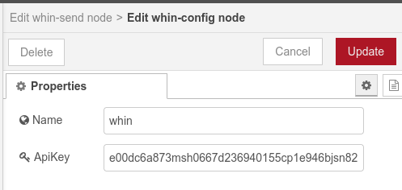

# Summary
Whin is a whatsapp gateway designed to be used at home-lab installations; on its simplest form factor the back-end is a shared gateway supporting the most frequent use cases, the client side is a set of node-red nodes available on the editor Palette.

Power users can signup for paid Tiers that support: special use-cases, custom front-ends / clients, extremely high throughput, or even a dedicated tenant. 


## Install: 

To install whin, your first choice should be using node-red editor Palette. Find the repo: inutil-labs@node-red-whin-whatsapp and install.

As an alt method: open a terminal, cd to the user directory (tipically ~/data/node_modules/), git clone this repository inside, cd into the folder created, and run this command:

    npm install inutil-labs@node-red-whin-whatsapp


## Set-up whin:

All whin nodes installed share a configuration node that stores your user credentials. You need to become a whin user to get your user credentials. There's a free Tier for home-Lab owners which will cover (hopefully) all your needs, so there's no intrinsic cost associated to use whin. If you click on this [link](https://www.youtube.com/watch?v=uOZ-oH4kP58) you can watch a step-by-step video showing how to get subscribed to whin **free Tier**.

If you don't like following videos, the back-end API documentation and how-to tutorials can be found [here](https://rapidapi.com/inutil-inutil-default/api/whin2/).

Once you get subscribed an ApiKey will show up: copy it; then open the configuration node and paste it on the field named: *ApiKey*. That's all you need to do to start using whin.

### About the ApiKey:
The *ApiKey* field is expecting a string, numbers and letters with no spaces. If you get stucked, check this [video](https://www.youtube.com/watch?v=uOZ-oH4kP58) and see from where can you copy the key that you have to paste on the config node.
A whin-config node looks like this when properly configured:



Note that the ApiKey value is linked with the phone number you used to sign-up. Consequently the messages sent from node-red will always be delivered by whin to the phone number linked with the ApiKey used. This is to prevent spam.

Each ApiKey is valid forever as long as you keep subscribed to whin; this remains true even if you are subscribed to the free plan.

### Infographic of the set-up:
This picture shows the overall process:
1. subscribe to the free tier and get an apikey.
2. send a sign-up message to link your phone number with the apikey.
3. config whin on node-red.


## Whin Nodes:
When you install inutil-labs@node-red-whin-whatsapp package, you will get several Nodes available on node-red Palette under the Network category: 
- whin-receive, 
- whin-send, 
- whin-confirm. 

These Nodes rely on a configuration Node called whin-config (not visible on the editor Palette).

### The Configuration Node (whin-config):
This node will be used to enter your credentials; the credentials will be available and shared among all whin nodes.
This is the field that you need to complete to set up the whin-config node:


### Sender Node (whin-send):
This is the node we recomend you start using, right after you filled in and saved the config-node.  Just select the configuration you did:


Wire an inject node to whin-send, press inject, and you should receive a whatsapp including the text. Anything that comes in whin-send as data payload will be sent.


### Receiver Node (whin-receive):
Whin-receive node will allow you sending whatsapps to your node-red environment, any text message you send to the whin number used to sign-up and get the token, will be received and treated as message payload by whin-receive.
You might create your own syntax to trigger stuff in your NR. Switching on lights or music, disconnect the alarm or run a sales report. Sky is the limit.


### Confirmation Node (whin-confirm):
This node sends a request to get an active user confirmation; when answered, you will get the response as an output of the node. 
There's a max time to answer on whatsapp, if you reach the time without answering, the output payload will contain a time-out msg.

whin-confirm node will take two inputs: a question and a time period. The question goes on the msg.payload property and a time-to-live (ttl) in the msg.ttl property (this integer number is treated as time, expressed in miliseconds). These are the two inputs expected.

When the node is triggered, it will send you a whatsapp with the question you entered on the payload, and you will have a time to answer it (yes/no). 
If you click "Yes" on whatsapp, you will get a "YES" as output of the node.
If you click "No", you will get a "NO" on node-red output.
If you reach the ttl and provide no answer, the node will default to a "Time-out" message.

Each transaction is unique, meaning that you can only get one output after each trigger: YES, NO or Time-out

We like to think of it as the SMS / push-notifications you get from your bank these days, but answered with a simple button. The main use-case here is allowing you to "authorize" the execution of a flow branch that you don't want to run without manual intervention on node-red.


Be mindful that if there is a whin-receive node running in parallel, the response will flow through both listeners. In that case, you might notice a difference.
whin-confirm will output Yes, No, or TimeOut while your whin-receive node will receive whatever the answer is together with a 'unique request identifier'. That's the raw response.

There's plenty of use-cases where one wants to grant permission to a flow, like: door opening, a server restart based on some alert / timing. In plain english: You get the request, you authorise, decline or ignore it.

The backend controls the message expirity as well and, should you exahust the ttl, will respond directly in your phone and won't send the response back to node-red.


## Types of messages:
Whin will send / receive several types of messages, you can send:
- text messages.
- buttons.
- lists.
- vCards.

You need to set the right payload schema so that the back-end understands the request you send, otherwise whin wont be able to route the message.

### Text message:
If you want to send a text, the msg.payload schema expected is:

```json
{
  "text" : "this is a text sent from whin"
}
```
You will send a regular text message.

### List message:
If you want to send a list, the msg.payload schema expected is:
```json
{
  "text": "This is a list",
  "footer": "nice footer, link: https://inutil.info",
  "title": "Amazing boldfaced list title",
  "buttonText": "Required, text on the button to view the list",
  [
    {
	"title": "Section 1",
	"rows": [
	    	{"title": "Option 1", "rowId": "option1"},
	    	{"title": "Option 2", "rowId": "option2", "description": "This is a description"}
		]
    },
   {
	"title": "Section 2",
	"rows": [
	    	{"title": "Option 3", "rowId": "option3"},
	    	{"title": "Option 4", "rowId": "option4", "description": "This is a description V2"}
		]
    },
  ]
}
```
This is how it looks the message that you will send:


### Buttons message:
If you want to send a set of buttons, the msg.payload schema expected is:
```json
{
    "text": "This is a button message",
    "footer": "Hello World",
    "buttons": [
  		{"buttonId": "id1", "buttonText": {"displayText": "Button 1"}, "type": 1},
  		{"buttonId": "id2", "buttonText": {"displayText": "Button 2"}, "type": 1},
  		{"buttonId": "id3", "buttonText": {"displayText": "Button 3"}, "type": 1}
		],
    "headerType": 1
}
```
This is how it looks the message that you will send:


### vCard message:
If you want to send a contact vCard, the msg.payload schema expected is:
```
{ 
    "displayName": "whin", 
    "contacts": 
    	[{ 'BEGIN:VCARD\n' // metadata of the contact card
            + 'VERSION:3.0\n' 
            + 'FN:whin bot\n' // full name
            + 'ORG:Inutil Labs;\n' // the organization of the contact
	    + 'TEL;type=CELL;type=VOICE;waid=34605797764:+34 605 797 764\n' // WhatsApp ID + phone number
            + 'END:VCARD' 
	}] 
}
```
This is how it looks the message that you will send:


## Sample Flows:

We are including a very simple set of flows under the examples folder on this repo. Use the examples to understand how the different messages formats are. We strongly recommend you use them to bootstrap your own use cases so that you get familiar with them.
Or you can also import this flow and test them all at once.


    [{"id": "cf90d56d.79ba58","type": "comment","z": "78016605e351f287","name": "Text Message","info": "","x": 890,"y": 60,"wires": []},{"id":"254b3eb.401ea42","type": "inject","z": "78016605e351f287","name": "Start","props": [{"p": "payload"}],"repeat": "","crontab": "","once": false,"onceDelay": 0.1,"topic": "","payload": "","payloadType": "date","x": 890,"y": 100,"wires": [["11978f99.6a17d"]]},{"id": "11978f99.6a17d","type": "function","z": "78016605e351f287","name": "SetMessage","func": "msg.payload = \n  {\n  'text' : 'Hello from whin'  \n  }\nreturn msg;","outputs": 1,"noerr": 0,"initialize": "","finalize": "","libs": [],"x": 1080,"y": 100,        "wires": [["c1a2645eccea04a2"]]},{"id": "d6f47f62.648318","type": "comment",        "z": "78016605e351f287",        "name": "VCARD",        "info": "",        "x": 870,        "y": 360,        "wires": []    },    {        "id": "fbcf69bd.f4d3d8",        "type": "inject",        "z": "78016605e351f287",        "name": "Start",        "props": [            {                "p": "payload"            }        ],     "repeat": "",        "crontab": "",        "once": false,        "onceDelay": 0.1,        "topic": "",        "payload": "",        "payloadType": "date",        "x": 890,        "y": 400,        "wires": [            [                "79ed70bc.d159b"            ]        ]    },    {        "id": "79ed70bc.d159b","type": "function","z": "78016605e351f287","name": "SetMessage","func": "const vcard = 'BEGIN:VCARD\\n' // metadata of the contact card\n            + 'VERSION:3.0\\n' \n            + 'FN:Alsa k0de\\n' // full name\n            + 'ORG:Inutil Labs;\\n' // the organization of the contact\n            + 'TEL;type=CELL;type=VOICE;waid=911234567890:+91 12345 67890\\n' // WhatsApp ID + phone number\n            + 'END:VCARD'\n\n\nmsg.payload = { \n        contacts: { \n            displayName: 'Alsak0de', \n            contacts: [{ vcard }] \n        }}\nreturn msg;\n","outputs": 1,"noerr": 0,"initialize": "","finalize": "","libs": [],"x": 1080,"y": 400,"wires": [["c1a2645eccea04a2"]]},{"id": "9f60d55f.a054d",       "type": "comment",        "z": "78016605e351f287",        "name": "List",      "info": "",        "x": 870,        "y": 160,        "wires": []    },    {        "id": "b773a4dc.c1b88",        "type": "inject",        "z": "78016605e351f287",      "name": "Start",        "props": [            {                "p": "payload"            }        ],        "repeat": "",        "crontab": "",        "once": false,        "onceDelay": 0.1,        "topic": "",
        "payload": "",
        "payloadType": "date",
        "x": 890,
        "y": 200,
        "wires": [
            [
                "893dbacb.e78468"
            ]
        ]
    },
    {
        "id": "893dbacb.e78468",
        "type": "function",
        "z": "78016605e351f287",
        "name": "SetMessage","func": "const sections = [\n    {\n\ttitle: \"Section 1\",\n\trows: [\n\t    {title: \"Option 1\", rowId: \"option1\"},\n\t    {title: \"Option 2\", rowId: \"option2\", description: \"This is a description\"}\n\t]\n    },\n   {\n\ttitle: \"Section 2\",\n\trows: [\n\t    {title: \"Option 3\", rowId: \"option3\"},\n\t    {title: \"Option 4\", rowId: \"option4\", description: \"This is a description V2\"}\n\t]\n    },\n]\n\nconst listMessage = {\n  'text': \"This is a list\",\n  'footer': \"nice footer, link: https://inutil.info\",\n  'title': \"Amazing boldfaced list title\",\n  'buttonText': \"Required, text on the button to view the list\",\n  sections\n}\n\n\nmsg.payload = listMessage;\nreturn msg;\n","outputs": 1,"noerr": 0,
        "initialize": "",
        "finalize": "",
        "libs": [],
        "x": 1080,
        "y": 200,
        "wires": [
            [
                "c1a2645eccea04a2"
            ]
        ]
    },
    {
        "id": "282dfc0.fee7904",
        "type": "comment",
        "z": "78016605e351f287",
        "name": "Buttons",
        "info": "",
        "x": 870,
        "y": 260,
        "wires": []
    },
    {
        "id": "8b0ec2c0.88f7c",
        "type": "inject",
        "z": "78016605e351f287",
        "name": "Start",
        "props": [
            {
                "p": "payload"
            }
        ],
        "repeat": "",
        "crontab": "",
        "once": false,
        "onceDelay": 0.1,
        "topic": "",
        "payload": "",
        "payloadType": "date",
        "x": 890,
        "y": 300,
        "wires": [
            [
                "a80c681f.e941d"
            ]
        ]
    },
    {
        "id": "a80c681f.e941d",
        "type": "function",
        "z": "78016605e351f287",
        "name": "SetMessage",
        "func": "const buttons = [\n  {'buttonId': 'id1', 'buttonText': {'displayText': 'Button 1'}, 'type': 1},\n  {'buttonId': 'id2', 'buttonText': {'displayText': 'Button 2'}, 'type': 1},\n  {'buttonId': 'id3', 'buttonText': {'displayText': 'Button 3'}, 'type': 1}\n]\n\nconst buttonMessage = {\n    'text': \"Hi it's button message\",\n    'footer': 'Hello World',\n    'buttons': buttons,\n    'headerType': 1\n}\n\n\nmsg.payload = buttonMessage;\nreturn msg;\n",
        "outputs": 1,
        "noerr": 0,
        "initialize": "",
        "finalize": "",
        "libs": [],
        "x": 1080,
        "y": 300,
        "wires": [
            [
                "c1a2645eccea04a2"
            ]
        ]
    },
    {
        "id": "c1a2645eccea04a2",
        "type": "whin-send",
        "z": "78016605e351f287",
        "name": "",
        "auth": "10698f5ae088e44c",
        "x": 1370,
        "y": 240,
        "wires": [
            [
                "e8d8ea3f64f747a6"
            ]]},{"id": "e8d8ea3f64f747a6","type": "debug","z": "78016605e351f287","name": "debug 31","active": true,"tosidebar": true,"console": false,"tostatus": false,"complete": "false","statusVal": "","statusType": "auto","x": 1560,"y": 240,"wires": []},{"id": "10698f5ae088e44c","type": "whin-config","name": "whin","apikey": "your_api_goes_here"}]


## Demo videos:


Do you want more videos? check this playlist: 
https://www.youtube.com/playlist?list=PLY4sFY6dmLqxpt3SM5IagyMSdCAc6WNMP

## Error handling:
There are two types of errors that you can get when using the nodes:
  1. Token - Number pair invalid. This means, very likely, that you did a mistake on your number / token values on the config node
  2. Token do not exist: You either did not complete the sign-up step, or your token has expired (due to 30 days of inactivity)

## Known bugs on previous releases. Please update to latest release if you notice these:
Occasionally, whin-receive and whin-confirm do not start capturing messages unless a 'deploy' is executed even if there are no changes.
whin-receive may show the listening status and yet messages may not arrive until a flow redeploy is executed.
whin-confirm times out and does not show the confirmation.

## Security:
While we have not implemented military-class security, we have done our best to secure data in transit and at rest.
However, it's our recommendantion to read carefully the Security questions and answers on our FAQ first:
https://github.com/inUtil-info/node-red-contrib-whin/wiki/FAQ

## Terms of use:
The service is free, you do not need to register, and we do not gather any Personal Info. 
We understand that the user sending the sign-up message wishes to use the service. The service is just 
sending whatsapp messages to the number that orginated the request. We do not share the numbers using the
service with anyone, nor we send messages to our users.
For now there is an hourly rate limit set to 10 messages per user. When you reach 10 msg in one hour your msgs will not be
delivered till the 1 hour timer is reset. Whin will send you a reminder of the limit. If you don't adjust how your runtime 
works and get to 50 msgs in 1 hr, your IP will be blocked. This is something we implemented as a consequence of the abuse usage of the service.
If you wish to stop using the service, you just want to stop using the node and your token will be deleted after 30 days.
